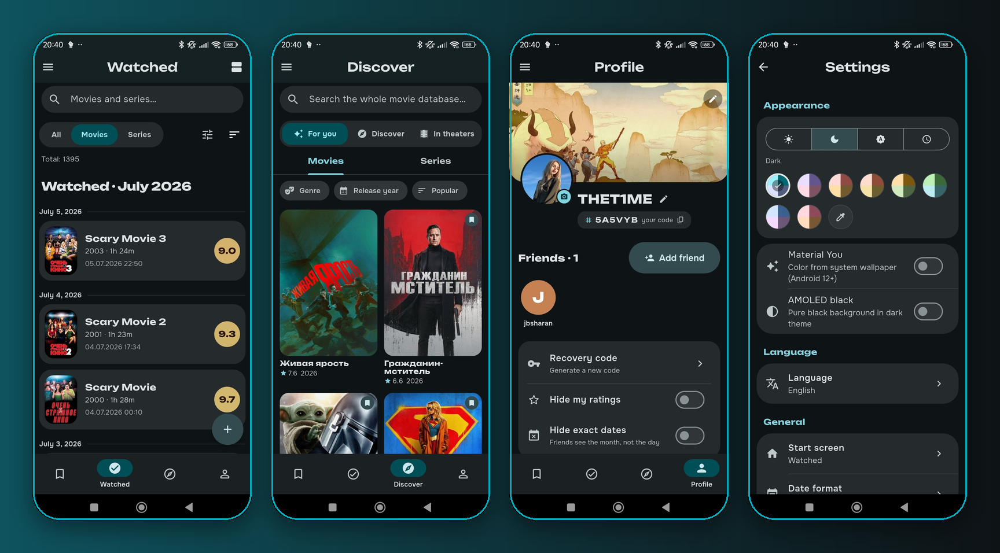

<div align="center">


# Kadr — Movie &amp; TV Tracker

<br>

[](https://github.com/THET1ME-1/Kadr/releases/latest)
[](https://github.com/THET1ME-1/Kadr/releases)
[](LICENSE)
[](https://github.com/THET1ME-1/Kadr/stargazers)
[](https://thet1me-1.github.io/Kadr/)


**A movie &amp; TV series tracker in Material 3 Expressive style** — bold design, rich statistics, deep customization, Trakt sync, Android TV. Local-first, open source.

🇬🇧 🇷🇺 🇩🇪 🇫🇷 🇪🇸 🇮🇹 🇵🇹 · 7 languages

[**🌐 Website**](https://thet1me-1.github.io/Kadr/) · [**⬇ Download**](https://github.com/THET1ME-1/Kadr/releases/latest) · [English](#english) · [Русский](#-kadr-русский)

<br>



</div>

---

## English

### Stack
- **Flutter** (Material 3 Expressive, dynamic color / Material You)
- **Content sources** (selectable in Settings): [TMDB](https://www.themoviedb.org/) · [PoiskKino](https://poiskkino.dev/) · [TheTVDB](https://www.thetvdb.com/). Each user brings their **own key** — except **TheTVDB**, which uses one project key (free for projects under **$50k/yr**, attribution required). The library stores cross-source IDs (imdb / tmdb / tvdb), so switching or dropping a source never loses your data.
- **Data**: local-first + JSON backup + sync (WebDAV / P2P)
- **Backend** (social / friends): Cloudflare Workers + D1 + R2 — entirely on the **free tier**
  (10 GB R2 with zero egress, $0). No secrets are stored in this repo.

### Features
- Light / dark / system / time-based themes, live color picker, 8 palettes, AMOLED
- Bottom-sheet dialogs everywhere, big pill-shaped buttons
- Mood ratings (Awful → Amazing), viewings grouped by month
- Social: friends, profiles with custom banners, "watched together", recommendations, shared lists
- **Trakt sync** — two-way sync of watched, watchlist & ratings (Kadr stays the source of truth)
- **Android TV** — installs on TV, remote (D-pad) navigation
- Release schedule, movie news, favorite actors & characters, custom local posters
- 7 languages: 🇬🇧 🇷🇺 🇩🇪 🇫🇷 🇪🇸 🇮🇹 🇵🇹 (auto-detected from the phone)

### Install (Android)
Distributed **only via GitHub Releases** (not on Google Play).

**Recommended — [Obtainium](https://github.com/ImranR98/Obtainium)** (auto-updates):
1. Install Obtainium.
2. **Add App** → paste `https://github.com/THET1ME-1/Kadr` → Add.
3. It finds the latest release; pick the APK for your CPU (`arm64-v8a` — almost all modern phones).

One-tap: `obtainium://add/https://github.com/THET1ME-1/Kadr`

Or download the APK from the [releases page](https://github.com/THET1ME-1/Kadr/releases/latest).

Signing fingerprint (SHA-256) to verify the APK:
`64:87:C6:84:BB:4B:DA:1B:1A:9C:22:72:4C:50:24:9D:00:06:04:E1:D4:18:1D:49:48:A5:B6:DA:6A:B8:CE:B8`

### TMDB API key (personal)
Movie data comes from [TMDB](https://www.themoviedb.org/). The key is **free and personal** —
on first launch each user enters **their own** token (a screen with instructions). No shared
keys ship in the repo or the builds.

Get one: themoviedb.org → **Settings → API** → create a key → copy the **API Read Access Token**
(v4, starts with `eyJ…`).

### Development
```bash
flutter pub get
# enter the token in-app, or bake it into your own build:
flutter run --dart-define=TMDB_TOKEN=<your_token> [--dart-define=KINOPOISK_KEY=<key>]
```

### License
[GPL-3.0](LICENSE) — free software with copyleft: any fork/derivative, when distributed,
must stay open under the same license.

This product uses the TMDB API but is not endorsed or certified by TMDB.
Metadata may also be provided by [TheTVDB](https://www.thetvdb.com/).

Roadmap & status — see [PLAN.md](PLAN.md).

---

## 🎬 Kadr (Русский)

**Kadr (Кадр)** — трекер просмотренных фильмов и сериалов в стиле **Material 3 Expressive**:
крупный дизайн, богатая статистика, кастомизация на максимуме, 7 языков. Локально-первично, открытый код.

### Стек
- **Flutter** (Material 3 Expressive, dynamic color / Material You)
- **Источники данных** (на выбор в настройках): [TMDB](https://www.themoviedb.org/) · [ПоискКино](https://poiskkino.dev/) · [TheTVDB](https://www.thetvdb.com/). Каждый вводит **свой ключ** — кроме **TheTVDB** (один ключ проекта: бесплатно для проектов до **$50k/год**, с атрибуцией). Библиотека хранит перекрёстные ID (imdb / tmdb / tvdb), поэтому смена или отключение источника не теряет данные.
- **Данные**: локально-первично + JSON-бэкап + синхронизация (WebDAV / P2P)
- **Бэкенд** (соц-слой / друзья): Cloudflare Workers + D1 + R2 — целиком на **бесплатном тарифе**
  (10 ГБ R2, нулевой исходящий трафик, $0). Секретов в репозитории нет.

### Особенности
- Тёмная/светлая/системная/авто темы, живой колор-пикер, 8 палитр, AMOLED
- Все попапы — нижними панелями, крупные «таблеточные» кнопки
- Оценки-настроения (Ужасно → Восхитительно), группировка просмотров по месяцам
- Соц: друзья, профили с баннерами, «посмотрел с другом», рекомендации, совместные списки
- **Синхронизация с Trakt** — двусторонний синк просмотренного, вишлиста и оценок (Kadr — источник правды)
- **Android TV** — ставится на ТВ, навигация пультом (D-pad)
- Расписание выхода серий, кино-новости, любимые актёры и персонажи, свои постеры
- 7 языков: 🇷🇺 🇬🇧 🇩🇪 🇫🇷 🇪🇸 🇮🇹 🇵🇹 (определяются по телефону)

### Установка (Android)
Распространяется **только через GitHub Releases** (не в Google Play).

**Рекомендуется — [Obtainium](https://github.com/ImranR98/Obtainium)** (авто-обновления):
1. Установи Obtainium.
2. **Add App** → вставь `https://github.com/THET1ME-1/Kadr` → Add.
3. Он найдёт последний релиз; выбери APK под свой процессор (`arm64-v8a` — почти все телефоны).

One-tap: `obtainium://add/https://github.com/THET1ME-1/Kadr`

Или скачай APK со [страницы релизов](https://github.com/THET1ME-1/Kadr/releases/latest).

Отпечаток подписи (SHA-256) для проверки APK:
`64:87:C6:84:BB:4B:DA:1B:1A:9C:22:72:4C:50:24:9D:00:06:04:E1:D4:18:1D:49:48:A5:B6:DA:6A:B8:CE:B8`

### API-ключ TMDB (личный)
Данные о фильмах — из [TMDB](https://www.themoviedb.org/). Ключ **бесплатный и персональный** —
при первом запуске каждый вводит **свой** токен (экран с инструкцией). В репозитории и сборках
**нет** чужих ключей.

Как получить: themoviedb.org → **Settings → API** → создать ключ → скопировать
**API Read Access Token** (v4, начинается с `eyJ…`).

### Разработка
```bash
flutter pub get
# токен можно ввести в приложении, либо вшить в свою сборку:
flutter run --dart-define=TMDB_TOKEN=<ваш_токен> [--dart-define=KINOPOISK_KEY=<ключ>]
```

### Лицензия
[GPL-3.0](LICENSE) — свободное ПО с копилефтом: любой форк/производная при распространении
должны оставаться открытыми под той же лицензией.

*Инфраструктура (тема, i18n, настройки, синхронизация) — ДНК проекта ScoreMaster.*

---

<div align="center">

## 👥 Team · S&amp;T Company

Kadr is built by **S&amp;T Company**

| | |
|:--|:--|
| [**THET1ME-1**](https://github.com/THET1ME-1) | founder · lead dev |
| [**JbSharan2**](https://github.com/JbSharan2) | co-founder |

<sub>App signing identity: <code>CN=Kadr, O=STGroup</code> · This product uses the TMDB API but is not endorsed or certified by TMDB.</sub>

</div>
